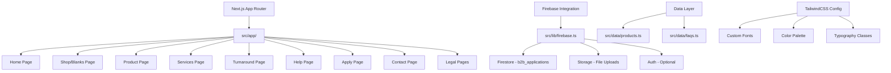

# PrintyHub Frontend Development Plan

## Overview
This plan outlines the creation of a production-ready frontend for PrintyHub using Next.js 14 with App Router, TypeScript, TailwindCSS, and Firebase v9 modular SDK. The application will be deployable to Firebase Hosting and follow a minimal, premium, editorial design inspired by WATC Studio.

## Architecture Overview



## Technical Stack
- **Framework**: Next.js 14 with App Router (src/app structure)
- **Language**: TypeScript with ESM
- **Styling**: TailwindCSS with custom configuration
- **Backend**: Firebase v9 modular SDK (Firestore, Storage, Auth, Hosting)
- **Validation**: Zod for schema validation
- **Fonts**: Bebas Neue, Anton, League Spartan, Inter (Google Fonts)

## Design System
- **Color Palette**:
  - Primary: Blanco (#FFFFFF), Gris Humo (#E5E5E5), Gris Piedra (#D9D9D9)
  - Secondary: Carbón (#2A2A2A), Negro (#111111)
  - Accents: Verde Militar (#2E4630), Beige Arena (#C9B39A), Azul Profundo (#203347)
- **Typography**:
  - Headings: Bebas Neue/Anton/League Spartan (uppercase, letter-spacing)
  - Body: Inter
- **Layout**: Minimal, premium, editorial style with ample white space, full-bleed images, no shadows/effects

## Firebase Schema
### b2b_applications Collection
```typescript
interface B2BApplication {
  companyName: string;
  nit: string;
  contactName: string;
  whatsapp: string;
  email?: string;
  city: string;
  clientType: 'marca' | 'agencia' | 'empresa' | 'dropshipper';
  interests: string[]; // ['blanks','dtf','dtg','bordado','tinte','etiquetado']
  monthlyVolume: '0-100' | '100-300' | '300-1000' | '1000+';
  notes?: string;
  briefFilePath?: string; // Firebase Storage path
  createdAt: Timestamp;
  status: 'new' | 'review' | 'approved' | 'rejected';
}
```

## Page Structure & Content

### 1. Home Page (/)
- Hero section with model image and "BLANKS PREMIUM PARA TU MARCA" copy
- CTAs: "Ver Catálogo" (links to /shop) and "Aplicar a B2B" (links to /apply)
- Sections: "Nuestros Blanks", "Servicios", "Proceso & Tiempos"

### 2. Shop/Blanks Page (/shop)
- 3x3 grid of product cards
- Each card: Large image, reference/color info
- Data sourced from src/data/products.ts

### 3. Product Page (/product/[id])
- Vertical gallery layout
- Product specifications (fit oversize, 230g Peruvian cotton, high seams, rib collar, size chart)
- "Solicitar cotización" CTA linking to /apply with product query

### 4. Services Page (/services)
- 5 service cards: DTF, DTG, Bordado, Tinte, Etiquetado
- Technical specs for each service
- "Cotizar" CTAs

### 5. Turnaround Page (/turnaround)
- Tables showing turnaround times by service and quantity

### 6. Help Page (/help)
- FAQ section populated from src/data/faqs.ts

### 7. Apply Page (/apply)
- B2B application form connected to Firestore
- File upload with drag-and-drop dropzone
- Form validation with Zod
- Success toast with application number
- Pre-load product data from URL query

### 8. Contact & Legal Pages
- Basic contact information
- Terms of service, privacy policy placeholders

## Implementation Phases

### Phase 1: Project Setup & Configuration
1. Initialize Next.js project with required dependencies
2. Configure TailwindCSS with custom fonts and color palette
3. Set up Firebase integration (app, db, storage, auth)
4. Create TypeScript interfaces and Zod schemas

### Phase 2: Data & Assets
1. Create sample data files (products.ts, faqs.ts)
2. Set up placeholder images and assets

### Phase 3: Core Pages Implementation
1. Implement Home page with all sections
2. Create Shop page with product grid
3. Build Product page template
4. Develop Services and Turnaround pages
5. Implement Help page with FAQ

### Phase 4: Forms & Integration
1. Build Apply page with form validation
2. Integrate Firebase Firestore for form submissions
3. Implement file upload to Firebase Storage
4. Add success/error handling and toasts

### Phase 5: Polish & Deployment
1. Ensure mobile-first responsive design
2. Implement accessibility features (AA contrast, focus states)
3. Configure Firebase Hosting deployment
4. Test local compilation and Firebase integration

## Accessibility & UX Requirements
- Mobile-first responsive design
- AA contrast ratios for text
- Visible labels on form inputs
- Proper focus states and keyboard navigation
- File dropzone with drag-and-drop and fallback input
- Error messages per field with clear validation

## Deployment Checklist
- [ ] Firebase project configured
- [ ] Environment variables set up
- [ ] Build process tested locally
- [ ] Firebase Hosting configured
- [ ] Domain setup (if applicable)
- [ ] SSL certificate (automatic with Firebase)

## Dependencies
- next: ^14.x
- react: ^18.x
- typescript: ^5.x
- tailwindcss: ^3.x
- firebase: ^10.x
- zod: ^3.x
- react-hook-form: ^7.x
- @hookform/resolvers: ^3.x
- react-hot-toast: ^2.x

This plan provides a comprehensive roadmap for building the PrintyHub frontend. Each phase builds upon the previous one, ensuring a structured and efficient development process.